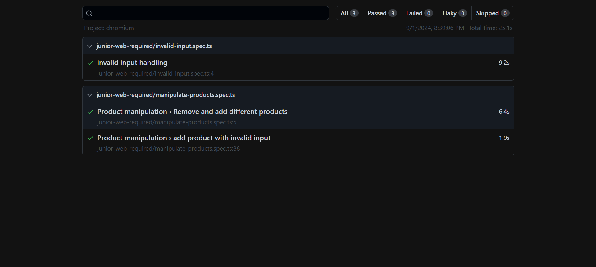

# Scandiweb Junior Developer test assignment!

## [Hosted Frontned URL](http://20.106.235.162:5173/)


## Backend URL
- [link](https://github.com/mohamed-ahmed-yousef/scandiweb-backend)

## Library used & Why?

- `React`: A frontend library.
- `TypeScript`: Enables type safety.
- `React Router DOM`: Manages routing.
- `Biome`: Lints and styles code, ensuring consistency and enforcing best practices.
- `Lefthook`: Manages pre-commit Git hooks for tasks like running tests and linters.
- `Axios`: A promise-based HTTP client for making asynchronous requests and handling responses.
- `SCSS`: Used for styling.

## Project Structure

### *Endpoint calls* :
- Implement my `API Layer` in this folder.
- Implement my own `useQuery`, `useMutation` to help me manage endpoint calls.
- trying in this folder to simplify the way I will call endpoint in the `view layer`

### *src folder* :
- has a four folders one for `shared components`, second for `add-product` page, third for `home page`, and last for `manage routing`
- implement a custom input validation `input field`
- implement a shared `button` with props like `variants`.

### *Utils* :
- Includes helper functions, shared hooks, and project constants, if available.

## Instructions to use this application

```shell
    git clone git@github.com:mohamed-ahmed-yousef/scandiweb-frontend.git;
    cd scandiweb-frontend;
    pnpm i;
    pnpm run dev;
    # then go to localhost:5173
```
- using docker
```shell
    git clone git@github.com:mohamed-ahmed-yousef/scandiweb-frontend.git;
    cd scandiweb-frontend;
    docker compose up --build -d;
    # then go to localhost:5173
```
## QA Testing Image
- [link](http://165.227.98.170/reports/20-106-235-162-1725215109670/index.html)
- Image
